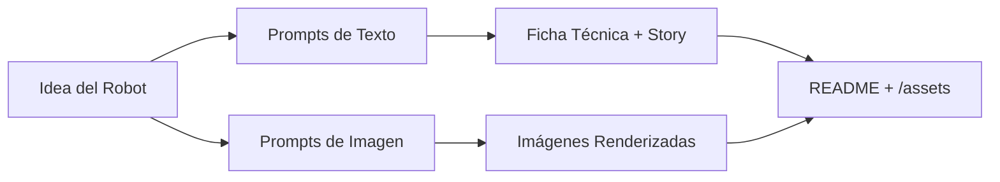

# Proyecto: Robot Antichoques IA‑Gen para Mina Subterránea ⛏️🤖

> **Hashtag del reto:** #LabDIONattyOrNot  
> **Objetivo:** crear un conjunto de contenidos “natty or not” (texto + imágenes) que presenten un robot móvil antichoques para ambientes mineros, usando IAs generativas.

---

## 📒 Descripción
Este proyecto genera un **brochure técnico** de un robot antichoques para minas subterráneas. El contenido (texto técnico, renders e infografías) fue creado con **modelos de linguagem** y **modelos generativos de imagen**. Se busca obtener resultados realistas y útiles para comunicación técnica y divulgación.

**Entregables principales**
- Texto técnico (ficha y narrativa corta).  
- 3–6 imágenes generadas del robot en diferentes escenas (galería /assets).  
- README con proceso, prompts y reflexión.

---

## 🎯 Objetivos (Natty or Not)
- **Realismo visual**: renders con iluminación y materiales plausibles para ambiente de mina.  
- **Coherencia técnica**: descripción que respete componentes usuales (ESP32‑WROVER/S3‑CAM, ultrasonidos, cámara, driver BTS7960, LoRa/Wi‑Fi, batería).  
- **Trazabilidad**: publicar **prompts** y pasos para reproducir.

---

## 🤖 Tecnologías Utilizadas
- **Texto**: ChatGPT / Claude (modelos de linguagem).  
- **Imagen**: DALL·E / Stable Diffusion (Automatic1111 o ComfyUI).  
- **Post‑proceso**: GIMP/Photoshop, upscaling (Real‑ESRGAN).  
- **Gestión**: GitHub (este repo), README en Markdown.  
- **Opcional (AWS)**: Amazon Bedrock (Claude/Titan), S3 para assets.

---

## 🧱 Arquitectura de Contenidos (Mermaid)


---

## 🧐 Proceso de Criação
1. **Definición del concepto**: robot con anti‑choque por **fusión ultrasónica + visión** y control difuso; comunicaciones **LoRa/Wi‑Fi**; ambiente: **mina subterránea** polvorienta con iluminación tenue.  
2. **Generación de texto**: se pidió a un LLM redactar ficha técnica (componentes, flujo de señales, control) y un resumen divulgativo de 120–180 palabras.  
3. **Ingeniería de prompts (imagen)**: iteración de estilos, encuadres y negativos;
   - Semillas fijas para reproducibilidad; variaciones por escena (túnel, bocamina, curva, obstáculo).  
4. **Generación de imágenes**: 3–6 piezas, selección por nitidez, composición y plausibilidad.  
5. **Post‑proceso**: recorte, limpieza de artefactos, upscaling.  
6. **Documentación**: este README + carpeta `/assets` con nombres consistentes.

---

## 🧪 Prompts Utilizados (ejemplos)
### Texto (Ficha técnica)
```
Escribe una ficha técnica concisa (≤ 180 palabras) para un robot móvil antichoques de mina subterránea que combina dos sensores ultrasónicos laterales y una cámara frontal (ESP32‑S3‑CAM). Procesa en ESP32‑WROVER, control difuso para giros suaves, driver BTS7960, comunicaciones LoRa/Wi‑Fi, dashboard web básico. Incluye: arquitectura de sensores→fusión→control→actuadores, criterios de seguridad (parada si obstáculo < 20 cm), autonomía > 90 min, IP‑rating sugerido, y consideraciones de polvo/iluminación.
```

### Imagen (DALL·E / SDXL)
```
"rugged autonomous mine inspection rover, compact tracked chassis, front wide‑angle camera, dual side ultrasonic sensors, LED headlight bar, dust in the air, wet rock walls, narrow underground tunnel, cinematic lighting, realistic textures, 35mm photograph, depth of field"
--negative "cartoon, toy, lowres, extra fingers, watermark, text, logo"
```

### Imagen (variantes de escena)
- **Curva pronunciada**: enfatizar faro y sombras laterales.  
- **Obstáculo a 15 cm**: primer plano con freno/maniobra.  
- **Bocamina con niebla**: contraluz, señalética de seguridad.

> Guarda las seeds y parámetros (CFG, steps, sampler) en `/assets/metadata.json` (opcional).

---

## 🚀 Resultados
- Ver carpeta **/assets**:
  - `scene_tunnel_01.png`
  - `curve_obstacle_02.png`
  - `portal_mine_03.png`
- Texto: `docs/ficha_tecnica.md` (o pega aquí el resumen final).

**Muestra (texto divulgativo, 140–160 palabras)**
> Este robot antichoques fue diseñado para navegar túneles de mina con visibilidad reducida y polvo en suspensión. Dos sensores ultrasónicos laterales miden continuamente la distancia a paredes y obstáculos, mientras la cámara frontal aporta contexto visual para anticipar maniobras. Un ESP32‑WROVER fusiona ambas fuentes y ejecuta un controlador de lógica difusa, generando giros y velocidades suaves. El accionamiento usa un BTS7960, robusto ante corrientes altas, y la conectividad LoRa/Wi‑Fi envía telemetría a un panel web básico (distancias, batería, alertas). Cuando un objeto se aproxima por debajo de 20 cm, el sistema aplica una parada segura. La autonomía supera los 90 minutos y se recomiendan sellos y carcasas con clasificación IP adecuada para ambientes polvorientos. Este enfoque prioriza la seguridad y la adaptabilidad en pasajes estrechos, reduciendo choques y mejorando la inspección.

---

## 🔁 Cómo Reproducir
1. Clona o **haz fork** de este repo en tu GitHub.  
2. Crea `/assets` y agrega tus imágenes generadas.  
3. (Opcional) Agrega `docs/ficha_tecnica.md` con el texto final.  
4. Actualiza este README con tus muestras y parámetros.  
5. Publica el enlace del repo en la plataforma DIO.

---

## ✅ Checklist de Entrega DIO
- [ ] Fork realizado en mi cuenta.  
- [ ] README completo (este archivo).  
- [ ] Imágenes en `/assets`.  
- [ ] Enlace enviado en la plataforma.  
- [ ] Post en redes con **#LabDIONattyOrNot**.

---

## 💭 Reflexión (Opcional)
- Dificultades para lograr manos/ruedas coherentes y escala respecto al túnel.  
- Negativos y seeds ayudaron a estabilizar el estilo.  
- El mayor reto fue equilibrar realismo vs. claridad técnica.

---

## 🗺️ Roadmap (Opcional)
- Añadir clip de 10–20 s con cámara en movimiento (text‑to‑video).  
- Generar infografía técnica (esquema de bloques) con IA + edición manual.  
- Publicar página GitHub Pages con galería.

---

## 📜 Licencia
MIT para el repositorio (ajusta según tus necesidades).  
Asegúrate de revisar los términos de uso de cada servicio de IA.

