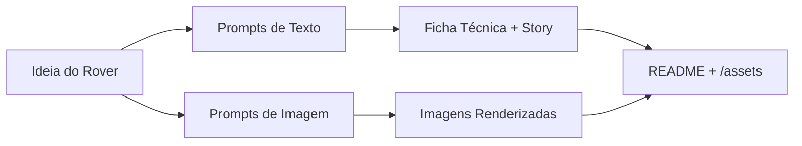

# Projeto: Rover Anticolisão IA‑Gen para Mina Subterrânea ⛏️🤖

> **Hashtag do desafio:** #LabDIONattyOrNot  
> **Objetivo:** criar um conjunto de conteúdos “natty or not” (texto + imagens) que apresentem um rover móvel anticolisão para ambientes minerários, usando IAs generativas.

---

## 📒 Descrição
Este projeto cria um **brochure técnico** de um rover anticolisão para minas subterrâneas. O conteúdo (texto técnico, renders e infográficos) foi produzido com **modelos de linguagem** e **modelos generativos de imagem**. Buscamos **realismo visual** e **coerência técnica** para comunicação de engenharia.

**Entregáveis principais**
- Texto técnico (ficha e narrativa curta).  
- 3–6 imagens geradas do rover em diferentes cenas (galeria em `/assets`).  
- README com processo, prompts, resultados e reflexão.

---

## 🎯 Objetivos (Natty or Not)
- **Realismo visual**: renders plausíveis para túneis de mina (poeira, umidade, luz limitada).  
- **Coerência técnica**: componentes típicos (ESP32‑WROVER/S3‑CAM, ultrassônicos, câmera, driver BTS7960, LoRa/Wi‑Fi, bateria).  
- **Rastreabilidade**: publicar **prompts** e passos para reprodução.

---

## 🤖 Tecnologias Utilizadas
- **Texto**: ChatGPT / Claude (LLMs).  
- **Imagem**: DALL·E / Stable Diffusion (Automatic1111 ou ComfyUI).  
- **Pós‑processo**: GIMP/Photoshop, upscaling (Real‑ESRGAN).  
- **Gestão**: GitHub (este repositório), README em Markdown.  
- **Opcional (AWS)**: Amazon Bedrock (Claude/Titan), S3 para assets.

---

## 🧱 Arquitetura de Conteúdo (Mermaid)


---

## 🧐 Processo de Criação
1. **Conceito**: rover com anticolisão por **fusão ultrassônica + visão** e controle fuzzy; comunicações **LoRa/Wi‑Fi**; ambiente: **mina subterrânea** com poeira e baixa iluminação.  
2. **Geração de texto**: solicitar a um LLM a redação da ficha (componentes, fluxo de sinais, controle) e um resumo de 120–180 palavras.  
3. **Prompt engineering (imagem)**: iterar estilos, enquadramentos e negativos; definir **seeds** para reprodutibilidade.  
4. **Geração de imagens**: 3–6 peças; selecionar por nitidez, composição e plausibilidade.  
5. **Pós‑processo**: recorte, limpeza de artefatos, upscaling.  
6. **Documentação**: este README + pasta `/assets` com nomes consistentes.

---

## 🧪 Prompts Utilizados (exemplos)
### Texto (Ficha técnica)
```
Escreva uma ficha técnica concisa (≤ 180 palavras) para um rover móvel anticolisão de mina subterrânea que combina dois sensores ultrassônicos laterais e uma câmera frontal (ESP32‑S3‑CAM). Processa em ESP32‑WROVER, controle fuzzy para giros suaves, driver BTS7960, comunicações LoRa/Wi‑Fi e dashboard web básico. Inclua: arquitetura de sensores→fusão→controle→atuadores, critérios de segurança (parada se obstáculo < 20 cm), autonomia > 90 min, IP rating sugerido e considerações de poeira/iluminação.
```

### Imagem (DALL·E / SDXL)
```
"rugged autonomous mine inspection rover, compact tracked chassis, front wide‑angle camera, dual side ultrasonic sensors, LED headlight bar, dust in the air, wet rock walls, narrow underground tunnel, cinematic lighting, realistic textures, 35mm photograph, depth of field"
--negative "cartoon, toy, lowres, extra fingers, watermark, text, logo"
```

### Imagem (variantes de cena)
- **Curva acentuada**: enfatizar farol e sombras laterais.  
- **Obstáculo a 15 cm**: close‑up mostrando frenagem/manobra.  
- **Bocamina com neblina**: contraluz, sinalização de segurança.

> Dica: guarde seeds e parâmetros (CFG, steps, sampler) em `/assets/metadata.json`.

---

## 🚀 Resultados
- Estrutura sugerida da pasta **/assets**:
  - `assets/scene_tunnel_01.png`
  - `assets/curve_obstacle_02.png`
  - `assets/portal_mine_03.png`
  - `assets/metadata.json` *(opcional com seeds e parâmetros)*
- Texto técnico: `docs/ficha_tecnica.md` *(conteúdo abaixo para copiar/colar)*

### docs/ficha_tecnica.md (exemplo)
```
Rover Anticolisão para Mina Subterrânea — Ficha Técnica (≤180 palavras)

O rover anticolisão foi projetado para navegação segura em túneis de mina com baixa visibilidade e poeira em suspensão. Dois sensores ultrassônicos laterais medem continuamente a distância de paredes e obstáculos, enquanto a câmera frontal (ESP32‑S3‑CAM) fornece contexto visual antecipando manobras. O processamento ocorre em um ESP32‑WROVER, que funde as medições e executa um controlador de lógica fuzzy para gerar comandos de direção e velocidade suaves. A tração é comandada por um driver BTS7960, adequado a correntes elevadas, e a conectividade LoRa/Wi‑Fi envia telemetria a um painel web simples (distâncias, nível de bateria, alertas). Quando um objeto é detectado abaixo de 20 cm, aplica‑se uma parada segura. A autonomia estimada supera 90 minutos. Recomenda‑se invólucros e vedações com classificação IP apropriada a ambientes poeirentos e úmidos, e cuidados com iluminação para melhor desempenho da câmera. Essa abordagem privilegia segurança e adaptabilidade em passagens estreitas, reduzindo colisões e aprimorando inspeções.
```

---

## 🔁 Como Reproduzir
1. Faça **fork** ou clone este repositório no seu GitHub.  
2. Crie a pasta `/assets` e adicione suas imagens geradas.  
3. Crie `docs/ficha_tecnica.md` com o texto acima (ou a sua versão final).  
4. Atualize este README com amostras e parâmetros.  
5. Submeta o link do seu repositório na plataforma da DIO.  
6. Compartilhe nas redes com **#LabDIONattyOrNot**.

---

## ✅ Checklist de Entrega (DIO)
- [ ] Fork realizado na minha conta.  
- [ ] README completo (este arquivo).  
- [ ] Imagens em `/assets`.  
- [ ] Link enviado na plataforma.  
- [ ] Post nas redes com **#LabDIONattyOrNot**.

---

## 💭 Reflexão (Opcional)
- Dificuldades em manter mãos/rodas e escala coerentes no túnel.  
- Prompts negativos e seeds ajudaram a estabilizar o estilo.  
- Maior desafio: equilibrar **realismo** vs. **clareza técnica**.

---

## 🗺️ Roadmap (Opcional)
- Adicionar clipe de 10–20 s com câmera em movimento (text‑to‑video).  
- Gerar infográfico técnico (diagrama de blocos) com IA + edição manual.  
- Publicar página no GitHub Pages com galeria.

---

## 📜 Licença
Licença MIT para este repositório (ajuste conforme necessidade).  
Revise os termos de uso de cada serviço de IA utilizado.

